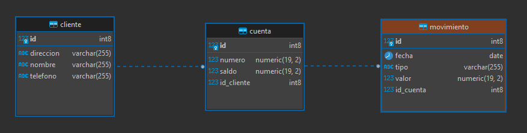

### Pre-Requisitos
1. Spring boot 2.4 o superior.
2. Java 11 o superior.
3. IDE preferido( IntelliJ, Eclipe, STS)
4. Postgres 13 o superior
5. Panel Administrativo Postgres(DBBeaver, PGAdmin)

### Notas: El proyecto está conectado a una BD local creada con PostgreSQL, se debe restaurar la backup de la BD(banco.sql) anexa a este proyecto

### Modelo relacion Base de datos(Banco)

### Instalación
1. Importar el proyecto como un proyecto Maven.
2. Descargar todas las dependencias necesarias para ejecutar el proyecto.
3. El puerto por defecto del proyecto es el 8080.
4. Para subir el servicio se debe ejecutar el archivo donde está el MainApplication.